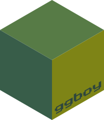

<!-- README.md is generated from README.Rmd. Please edit that file -->
```{r, include = FALSE}
knitr::opts_chunk$set(
  collapse = TRUE,
  comment = "#>",
  fig.path = "man/figures/README-",
  dpi = 300,
  out.width = "320px",
  fig.asp=0.9
)
```

# ggboy 

<!-- badges: start -->
[](https://lifecycle.r-lib.org/articles/stages.html#experimental)
<!-- badges: end -->

`ggboy` simulates the retro aesthetic of low resolution ordered image dithering cameras.

**This project is for fun. It creates outputs solely based on artistic merits (what looks good to my eye)**
**My attempt at implementing ordered dithering is not precise. This project is not an exact technical replication of anything**

`ggboy` is built upon the `ggplot2` and `magick` R packages for plotting and image processing.

* Images are resized and cropped (centrally by default) to have pixel dimensions of width = 128 and height = 112
* A 16 pixel frame border is applied to all sides, meaning the final image will have width = 160 and height = 144
* By default a blank (solid colour) 16 pixel frame is used - but any image can be used to create a frame with `image_to_frame()` (see examples below)
* Final output images will consist of a maximum of 4 colours
* There are options to set the amount of dithering, resize filters and colour palette used
* There is an experimental function for creating gifs `ggboy_gif()` (see example below)
* There is also a helper function for saving `ggboy` outputs at the correct size `ggboy_save()`

```{r}
library(ggboy)
```

* Read an example image
```{r}
img <- "https://sipi.usc.edu/database/preview/misc/house.png"
```

```{r echo=FALSE, fig.asp=1, out.width="320px"}
magick::image_read(img)
```

* Output using `ggboy()` default values
```{r}
ggboy(img)
```

## Modify dithering 'spread'
* An attempt at controlling the amount of dithering `dither_spread`
* Set to 0 for no dithering (default = 0.25)
```{r}
purrr::walk(
  .x = c(0, 0.1, 0.2, 0.3), 
  .f = ~print(ggboy(img, dither_spread = .x)))
```

## Modify colour palette
* Change colour palette with the `palette` argument
* Specify any 4 colour palette ordered from dark to light (or light to dark to invert the image) 
```{r}
purrr::walk(
  .x = list(
    c("#000000", "#4D4D4D", "#999999", "#E6E6E6"),
    c("#000000", "#4D4D4D", "#999999", "#E6E6E6") |> rev(),
    c("#405010", "#708028", "#A0A840", "#D0D058"),
    c("#0D0887", "#9C179E", "#ED7953", "#F0F921")),
  .f = ~print(ggboy(img, palette = .x)))
```

## Extension frames
* You can extend `ggboy` by using any image as a frame with the `image_to_frame()` function (or by creating the frame data yourself)
* If the chosen image is not already the correct dimensions (160 pixels wide x 144 pixels high), `image_to_frame()` will scale and crop the image first
  * The outer 16 pixels of the provided image can then be used as the frame by passing the output to the `frame_data` argument of `ggboy()`
  * No dithering is applied to the frame image
* Below are some examples using images as frames
```{r}
ggboy(
  img = img,
  frame_data = image_to_frame("https://i.imgur.com/lq58kIb.png"))
```

```{r}
ggboy(
  img = img,
  frame_data = image_to_frame("https://upload.wikimedia.org/wikipedia/commons/3/3f/Game_Boy_Camera.png"))
```

```{r}
ggboy(
  img = img,
  frame_data = image_to_frame("https://channard.files.wordpress.com/2017/05/gb-camera-rahmen-16.jpg"))
```

```{r}
ggboy(
  img = img,
  frame_data = image_to_frame("https://i.imgur.com/SxTRr.jpg"))
```

```{r eval=FALSE, echo=FALSE}
ggboy(
  img = img,
  frame_data = image_to_frame("https://i.987967.xyz/screenshot/42/c/16794_db7f096fa34d8ea59380399879a92a0dfd8a50d9.png")) 
```

### Manual frame text 
* Below is an example of using the `{magick}` package to create a frame with user-defined text
```{r message = FALSE}
library(magick)
ggboy(
  img,
  frame_data = 
    image_to_frame(
      image_read(matrix(rep("black", 160*144), ncol = 160)) |>
        image_annotate("Your text here", "north", color = "white", size = 15, weight = 700) |>
        image_annotate("...AND HERE!", "south", color = "white", size = 13, style = "italic", location = "+0+1")))
```

## Animated GIFs
* There is an experimental, slow and janky attempt at creating animated gifs with the `ggboy_gif()` function
```{r gif, eval = TRUE, message=FALSE}
ggboy_gif(
  gif = "https://media.tenor.com/l4PitD9s0cEAAAAM/mind-blown.gif", 
  scale = 2,
  first_n = 50,
  fps = 10,
  frame_data = image_to_frame("https://upload.wikimedia.org/wikipedia/commons/3/3f/Game_Boy_Camera.png"))
```

